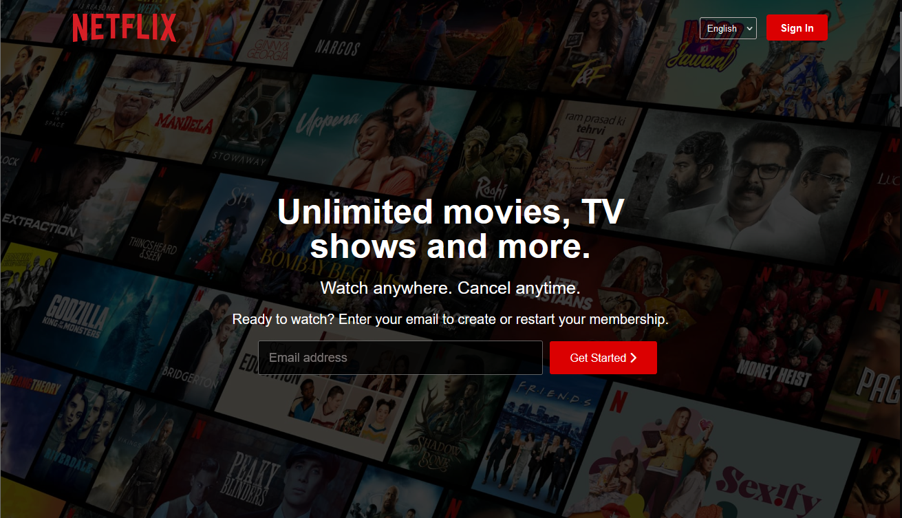
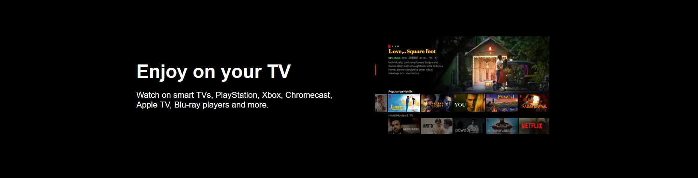
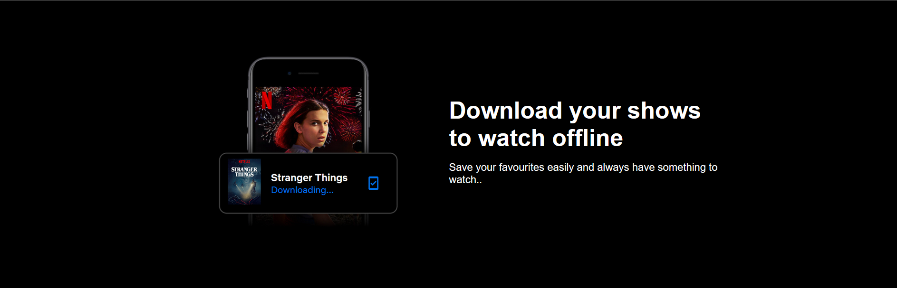
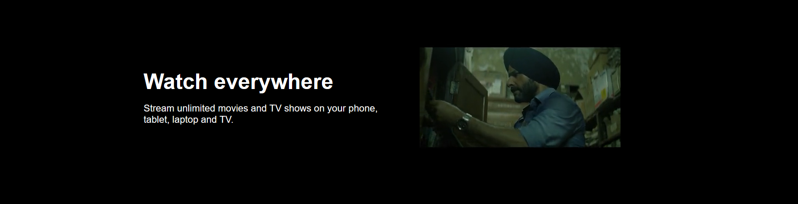
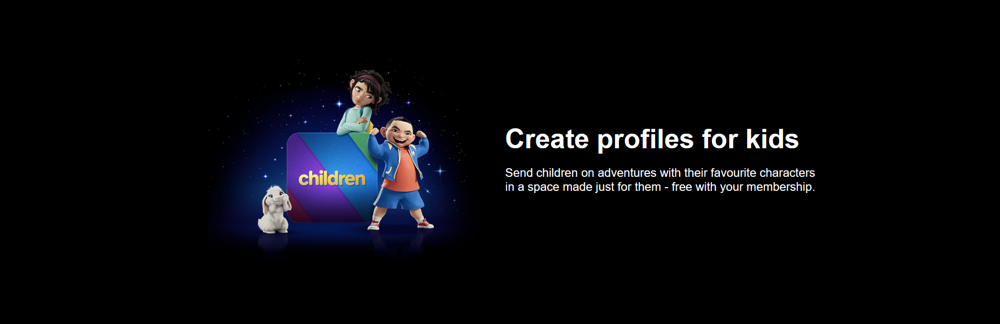
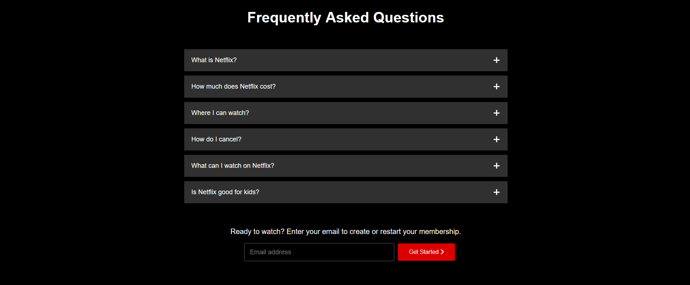
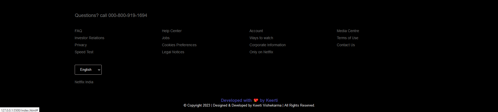
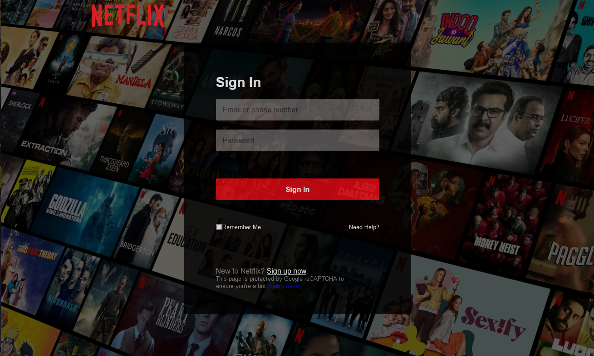
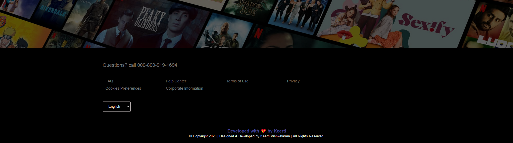

<h1 align="center">
  
  <br>
  Netflix Home Page and Signin PageClone Using HTML And CSS
</h1>

This is the core code from scratch to clone the landing page and signin page of Netflix using HTML and CSS.

This repository contains the code for building a Netflix-inspired home page and signin page using HTML and CSS. The project aims to recreate the visual design and layout of the Netflix home page, providing a starting point for creating similar interfaces or learning web development techniques.

# Features

- Responsive design: The web page adapts to different screen sizes, ensuring a consistent user experience on desktop and mobile devices.
- CSS styling: The stylesheets provide a sleek and modern look, resembling the Netflix branding.


# Table of Contents

- [Project Walk-Through](#project-walk-through)
- [Home Page](#home-page)
- [Sign-in Page](#sign-in-page)
- [Demo](#demo)
- [Technology Used](#technology-used)
  - [Getting Started](#getting-started)
  - [Contributing](#contributing)
- [Show Your Support](#show-your-support)
- [Acknowledgments](#acknowledgments)
  - [Contact](#contact)
  - [License](#license)

# Project Walk-Through

 # Home Page

<div align="center"><a name="menu"></a>








</div>

The Home Page consists of 5 main sections:

***1) Header, which includes:***
- Logo: 
it redirects you to the home page when you click on it.

- Sign-in button: 
 it redirects you to the sign-in page.

- Feature title & subtitle:
It shows the main sentences of the website.

***2) Optform:***
It's a text input field and a button,  It redirects you to the sign-up page once you click on the button(not working).

***3) Jumbotron:***
This section contains some images and paragraphs beside it, showing the advantages of Netflix. 

***4) Frequently Asked Questions:***
This section contains the FAQs in a form of accordion, when you click anywhere in the gray area of the question the answer appears below it, and then you can close the answer by clicking again on the same gray area of the question.

***5) Footer:***
It contains useful links users may need it.


***### The page is fully responsive to all mobile devices even the small ones. ###***


# Sign-in Page
 
 <div align="center"><a name="menu"></a>



</div>

The Sign-in Page consists of 3 main sections:

***1) Header, which includes:***
- Logo: 
it redirects you to the home page when you click on it.

***2) Sign-in Form, which includes:***
- Email address input field.

- Password input field.

- Sign-in Button

- Link to Sign-up Page:  it redirects you to the home page. 

***3) Footer:***
It contains useful links users may need it.

***### The page is fully responsive to all mobile devices even the small ones. ###***

# Demo

***Take a look - Live Demo:*** 

- [Live Demo Link](https://github.com/keerti1924/Netflix-Landing-Page.git)


# Technology Used

I have built this project using the following tools & techniques:

- HTML
- CSS 
- VSCode
- Github Actions
- Github Pages


# Getting Started

To get started with this project, follow these steps:

1. Clone the repository:

```bash
git clone https://github.com/keerti1924/Netflix-Clone.git
```

2. Open the project in your preferred code editor.

3. Launch the `index.html` file in a web browser to view the Netflix home page.

4. Feel free to modify the code and customize the page according to your preferences. You can update the content, change the colors, or add new features.

# Contributing

Contributions to this project are welcome. If you find any issues or have suggestions for improvements, please open an issue or submit a pull request.

# Show Your Support

Give a ⭐️ if you like this project!

# Acknowledgments

- The design and inspiration for this project come from the official Netflix website.
- Special thanks to the open-source community for providing helpful resources and tutorials on web development.
- Hat tip to everyone helped me to learn the techniques used in building this project.

# Contact

If you have any questions, suggestions, or feedback, you can reach out to the project maintainer:

- Name : [Keerti Vishwkarma](https://www.linkedin.com/in/keerti-vishwkarma-8ba754243/)
- Email: [keertidvcorai@gmail.com](mailto:keertidvcorai@gmail.com)

---

Enjoy exploring the code and creating your own Netflix-like home pages!

# License

This project is licensed under the [MIT License](LICENSE). Feel free to use the code for personal or commercial purposes.